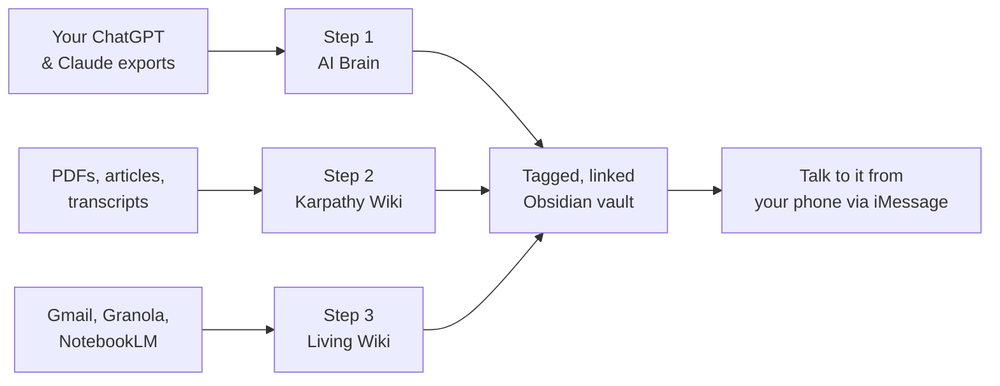

# AI Second Brain

> A Claude Code skill that walks you through building a living, searchable, AI-powered knowledge base from your own ChatGPT and Claude history, your raw research, and your daily inputs.

On 3rd April 2026, [Andrej Karpathy](https://github.com/karpathy) published a 1,500-word gist describing how to build a personal wiki using a folder of markdown and an LLM. Within 48 hours the X thread about it hit **16 million views**.

This skill packages Karpathy's idea — plus an AI-history organiser by [Alex Freedman](https://instagram.com/alex2learn) and the slash-command workflow shared by [Greg Isenberg](https://www.youtube.com/@GregIsenberg) — into a single Claude Code skill that walks any user through the full setup.

Built for non-technical readers of [MarTech AI](https://charliehills.substack.com).

---

## Install

The reliable way (works on every Mac, easy to update later):

```bash
git clone https://github.com/charlie947/ai-second-brain.git ~/.claude/skills/ai-second-brain
```

If `~/.claude/skills/ai-second-brain` already exists, back it up first:

```bash
mv ~/.claude/skills/ai-second-brain ~/.claude/skills/ai-second-brain.backup
```

Then open Claude Code in any folder and say:

> Set up my AI second brain.

To update later:

```bash
cd ~/.claude/skills/ai-second-brain && git pull
```

### Verify it installed

In Claude Code, type:

```
/skills
```

You should see `ai-second-brain` in the list. If you don't, the folder is in the wrong place — re-run the clone command and double-check the destination path.

---

## What it does



The skill walks you through three stages. You can do all three or pick one — just tell it.

1. **AI Brain** — exports your full ChatGPT and Claude history and turns the lot into a tagged, linked Obsidian vault you can search by topic, project, or person.
2. **Karpathy Wiki** — sets up a `raw/` and `wiki/` folder pair so Claude Code can compile a *living* wiki from your research. Drop a PDF in, the wiki updates itself.
3. **Living Wiki** — connects Gmail, NotebookLM and Granola, sets up iMessage Channels so you can text your second brain from your phone, and scaffolds three slash commands (`/today`, `/ideas`, `/create`).

Every step where Claude Code can do the work for you, it does. Every step that needs you (data exports, granting macOS permissions, NotebookLM browser login) pauses until you confirm.

## What you need before starting

- [Claude Code](https://docs.anthropic.com/claude-code) installed and working
- [Obsidian](https://obsidian.md) (free)
- About 30 minutes of attention, plus 1–3 days of background waiting for OpenAI to email your ChatGPT export

---

## Trigger phrases

The skill activates when you ask Claude Code anything like:

- "Set up my AI second brain"
- "Build the Karpathy wiki"
- "Organise my ChatGPT conversations in Obsidian"
- "I exported my ChatGPT data, what now?"
- "Help me set up iMessage Channels"
- "Create the /today, /ideas and /create slash commands"

Already done part of it? Just say "skip step 1, I've already done it".

---

## FAQ

**Does this send my data anywhere?**
No. Everything lives in folders on your Mac. The only network calls are the ones Claude Code already makes to Anthropic to run the LLM. Your conversations, your wiki, and your raw sources never leave your machine.

**Will it read my email automatically?**
Only when you tell it to, and only the threads relevant to whatever you've asked. Claude Code asks for permission before connecting to Gmail, and you can revoke access at any time from your Google account.

**Can I uninstall it?**
Yes:
```bash
rm -rf ~/.claude/skills/ai-second-brain
```
This removes the skill. It does **not** touch your Obsidian vault, raw folder, or wiki — your data stays.

**Does it work on Windows?**
Steps 1 and 2 work on any OS. Step 3b (iMessage Channels) is Mac-only — iMessage doesn't exist on Windows. Skip that step or use the Telegram/Discord version of Channels instead.

**What if I don't want iMessage Channels?**
Skip step 3b entirely. Steps 3a (connectors) and 3c (slash commands) work without it. You'll still have a living wiki you can use from your laptop.

**Will the skill be updated as Claude Code, NotebookLM, etc. change?**
Yes. Run `cd ~/.claude/skills/ai-second-brain && git pull` to grab the latest version. See [CHANGELOG.md](./CHANGELOG.md) for what changed.

---

## Credits

This skill stands on the shoulders of three people. None of the underlying ideas are mine. The skill exists to package what they already shared so it takes ten minutes instead of ten hours.

- **[Andrej Karpathy](https://github.com/karpathy)** — published the [original gist](https://gist.github.com/karpathy/442a6bf555914893e9891c11519de94f) on 3rd April 2026 describing how to maintain a living wiki with an LLM and a folder of markdown. The wiki framework — `raw/`, `wiki/`, `CLAUDE.md` — is his.
- **Alex Freedman ([@alex2learn](https://instagram.com/alex2learn))** — wrote the AI Brain export-and-organise process this skill adapts in Step 1.
- **[Greg Isenberg](https://www.youtube.com/@GregIsenberg)** — published the YouTube breakdown of slash commands built on top of an Obsidian vault that Step 3c is based on. Three commands here, twelve in his video.

I (Charlie Hills) wrote the skill that orchestrates all three and walks you through the parts that trip people up.

---

## About the author

I'm Charlie Hills — founder of [Vislo](https://www.vislo.ai/), an AI image editing tool, and writer of [MarTech AI](https://charliehills.substack.com), a weekly Substack on what I'm actually building with AI as a creator with 200k+ LinkedIn followers.

If you got value from this skill, the newsletter is where to find more.

Reach me on [LinkedIn](https://linkedin.com/in/charlie-hills) or [Instagram](https://instagram.com/charliehills).

---

## Licence

MIT. Fork it, modify it, rebrand it — just don't strip the credits to Karpathy, Alex and Greg. Their work is what makes this useful.
